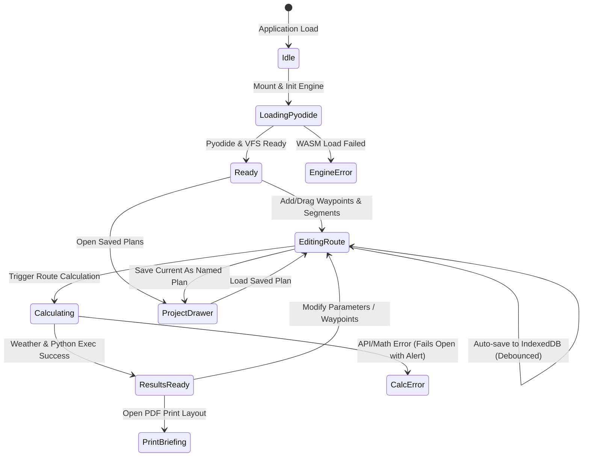

# Data Model: Modern Svelte 5 Frontend Migration

## Domain Entities

### 1. Waypoint
Represents a geographic navigation fix along a flight route.

```typescript
export interface Waypoint {
  id: string;                 // Unique identifier (e.g., 'wp-1724601234-1')
  lat: number;                // WGS84 Latitude (-90 to +90)
  lng: number;                // WGS84 Longitude (-180 to +180)
  name: string;               // Display identifier / resolved aerodrome name (e.g., "LEBA (Córdoba)")
  elevationFt?: number;       // Ground elevation in feet AMSL
  isManualName?: boolean;     // Whether the user manually renamed this waypoint
}
```

**Validation Rules**:
- `lat` must be between -90 and 90.
- `lng` must be between -180 and 180.
- `name` cannot be empty (defaults to `WP #` or `Waypoint {lat},{lng}`).

---

### 2. RouteSegment
A discrete portion of the route grouped under a specific cruise altitude.

```typescript
export interface RouteSegment {
  id: string;                 // Unique identifier (e.g., 'seg_1')
  cruiseAlt: number;          // Cruise Altitude in feet (e.g., 5500)
  waypointIds: string[];      // Ordered list of Waypoint IDs belonging to this segment
  collapsed?: boolean;        // UI display state in waypoint drawer
  color?: string;             // Distinct color code for map polyline rendering
}
```

**Validation Rules**:
- `cruiseAlt` must be a positive integer > 0 ft (typically 500 to 45,000 ft in steps of 500/1000 ft).
- Segment list must contain at least 1 segment.
- Every waypoint in the flight plan belongs to exactly one segment in sequential order.

---

### 3. FlightProfile
Aircraft performance parameters and operational flight metadata.

```typescript
export interface FlightProfile {
  depIcao: string;            // Departure ICAO or identifier (e.g., 'LEBA')
  destIcao: string;           // Destination ICAO or identifier (e.g., 'LEMD')
  altIcaos: string[];         // Alternate aerodromes list (e.g., ['LETO', 'LEVS'])
  departureTime: string;      // ISO 8601 UTC timestamp or local datetime string
  cruiseTas: number;          // True Airspeed in cruise (knots, e.g., 80)
  initialAlt: number;         // Initial departure/takeoff altitude (feet AMSL, e.g., 300)
  arrivalAlt: number;         // Destination pattern/circuit altitude (feet AMSL, e.g., 2000)
  climbVy: number;            // Best rate of climb airspeed (knots, e.g., 70)
  climbRateFpm: number;       // Climb vertical speed (feet per minute, e.g., 700)
  descentRateFpm: number;     // Descent vertical speed (feet per minute, e.g., 500)
}
```

**Validation Rules**:
- `departureTime` must be a valid parseable datetime.
- `cruiseTas` > 0 and `climbVy` > 0.
- `climbRateFpm` > 0 and `descentRateFpm` > 0.
- `initialAlt` and `arrivalAlt` must be >= 0.

---

### 4. ChartOverlay
A georeferenced raster aeronautical chart layer displayed on the Leaflet map.

```typescript
export interface ChartOverlay {
  id: string;                 // Unique ID (e.g., 'chart_sevilla_vfr')
  name: string;               // Display title (e.g., 'ENAIRE VFR Sevilla 1:500k')
  bounds: {                   // LatLng bounds in WGS84
    southWest: [number, number];
    northEast: [number, number];
  };
  canvasElement?: HTMLCanvasElement;
  imageBlobUrl?: string;      // Renderable raster data URL or object URL
  opacity: number;            // 0.0 to 1.0
  visible: boolean;           // Active display toggle
  sourceType: 'online_catalog' | 'user_upload';
  sourceUrl?: string;         // Remote download URL if from ENAIRE catalog
}
```

---

### 5. NavLogEntry & SemicircularNotice
Computed flight calculation output metrics generated per flight leg.

```typescript
export interface NavLogEntry {
  legIndex: number;
  fromName: string;
  toName: string;
  fromLat: number;
  fromLng: number;
  toLat: number;
  toLng: number;
  phase: 'CLIMB' | 'CRUISE' | 'DESCENT' | 'LEVEL';
  altitudeFt: number;
  trueCourseDeg: number;      // 0-359°
  windSpeedKt: number;
  windDirDeg: number;         // 0-360°
  wcaDeg: number;             // Wind correction angle (+/- degrees)
  trueHeadingDeg: number;     // 0-359°
  tasKt: number;
  groundSpeedKt: number;      // Knots
  distanceNm: number;         // Nautical miles
  eteMinutes: number;         // Estimated Time Enroute for leg
  etaUtc: string;             // Estimated Time of Arrival (HH:MMZ)
  notes?: string;             // Transition notes (e.g. "TOC", "TOD", "Cruise level change")
}

export interface SemicircularNotice {
  segmentIndex: number;
  fromName: string;
  toName: string;
  magneticTrackDeg: number;
  assignedAltitudeFt: number;
  ruleDirection: 'EASTBOUND' | 'WESTBOUND'; // East: 000-179°, West: 180-359°
  isCompliant: boolean;
  recommendedAltitudes: number[]; // e.g. [3500, 5500, 7500] for East
  advisoryMessage: string;
}
```

---

### 6. NotamAlert
A filtered aeronautical notice intersecting the flight route corridor or aerodromes.

```typescript
export interface NotamAlert {
  id: string;                 // NOTAM ID (e.g., 'A1234/26')
  location: string;           // ICAO code or region
  validFrom: string;          // ISO datetime string
  validTo: string;            // ISO datetime string
  qCode: string;              // ICAO Q-code
  purpose: string;            // Checklist / Scope
  lowerLimitFt?: number;
  upperLimitFt?: number;
  corridorDistanceKm?: number;// Distance to closest route leg
  text: string;               // Raw NOTAM text
  summary: string;            // Human-readable parsed briefing summary
  severity: 'WARNING' | 'CAUTION' | 'INFO';
}
```

---

### 7. SavedFlightPlan
Persistent project entity stored in IndexedDB.

```typescript
export interface SavedFlightPlan {
  id: string;                 // UUID v4
  name: string;               // User-provided plan title (e.g. "Córdoba to Madrid VFR")
  createdAt: number;          // Epoch timestamp
  updatedAt: number;          // Epoch timestamp
  waypoints: Waypoint[];
  segments: RouteSegment[];
  profile: FlightProfile;
  summary?: {
    depIcao: string;
    destIcao: string;
    totalDistanceNm: number;
    totalEteMinutes: number;
  };
}
```

---

## State Transitions & Life Cycles


