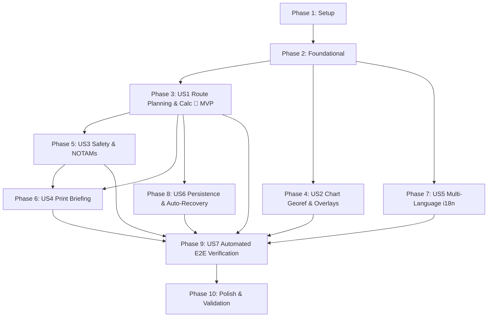

# Tasks: Modern Svelte 5 Frontend Migration & Test Suite

**Input**: Design documents from `/specs/001-migrate-svelte-frontend/`
**Prerequisites**: [plan.md](plan.md), [spec.md](spec.md), [research.md](research.md), [data-model.md](data-model.md), [contracts/](contracts/)
**Constitution**: Verified against [.specify/memory/constitution.md](../../.specify/memory/constitution.md)

## Format: `[ID] [P?] [Story] Description`

- **[P]**: Can run in parallel (different files, no dependencies)
- **[Story]**: User story mapping (`[US1]` to `[US7]`) for story-specific phases
- File paths are exact and project-relative (`frontend/` or `backend/`)

---

## Phase 1: Setup (Shared Infrastructure)

**Purpose**: Project initialization, dependency management, and build synchronization tooling

- [X] T001 Add runtime and build dependencies (`leaflet`, `@types/leaflet`, `geotiff`, `proj4`, `@types/proj4`, `fflate`, `idb`) in `frontend/package.json`
- [X] T002 Implement build-time Python module sync script in `frontend/scripts/sync-python.js` and configure `prepare` and `build` scripts in `frontend/package.json`
- [X] T003 [P] Configure Leaflet styles, Pyodide CDN assets, and WASM static headers in `frontend/src/app.html` and `frontend/vite.config.ts`

---

## Phase 2: Foundational (Blocking Prerequisites)

**Purpose**: Core domain types, WASM runtime, georeferencing math, and reactive state stores

**⚠️ CRITICAL**: No user story work can begin until this foundational phase is complete

- [X] T004 Define domain TypeScript interfaces (`Waypoint`, `RouteSegment`, `FlightProfile`, `NavLogEntry`, `ChartOverlay`, `NotamAlert`, `SavedFlightPlan`) in `frontend/src/lib/types/flight.ts` per `specs/001-migrate-svelte-frontend/data-model.md`
- [X] T005 [P] Implement IndexedDB repository and storage schema (`planenificator_db`) in `frontend/src/lib/services/storage.ts` per `specs/001-migrate-svelte-frontend/contracts/storage-schema.ts`
- [X] T006 [P] Implement Pyodide WASM runtime manager with micropip package mounting and VFS module loading in `frontend/src/lib/services/pyodide.svelte.ts` per `specs/001-migrate-svelte-frontend/contracts/pyodide-engine.ts`
- [X] T007 [P] Implement raster aeronautical chart georeferencing, TFW world file parsing, Proj4 LCC/UTM transforms, and canvas downsampling in `frontend/src/lib/services/georef.ts` per `specs/001-migrate-svelte-frontend/contracts/chart-georef.ts`
- [X] T008 [P] Implement reactive Svelte 5 flight plan state manager (`FlightPlanStore`) with waypoints, segments, and profile getters/setters in `frontend/src/lib/state/flight-plan.svelte.ts`
- [X] T009 [P] Implement reactive Svelte 5 calculation and safety state manager (`CalculationStore`) in `frontend/src/lib/state/calculation.svelte.ts`
- [X] T010 [P] Implement reactive Svelte 5 chart layer state manager (`ChartStore`) in `frontend/src/lib/state/charts.svelte.ts`
- [X] T011 Setup root layout, base Tailwind CSS styling, and HUD cockpit structure in `frontend/src/routes/+layout.svelte` and `frontend/src/routes/layout.css`

**Checkpoint**: Core foundation ready - user story implementation and independent testing can now begin.

---

## Phase 3: User Story 1 - Interactive VFR Route Planning & Calculation (Priority: P1) 🎯 MVP

**Goal**: Plot multi-waypoint routes on an interactive Leaflet map, configure aircraft performance parameters, trigger client-side Pyodide flight calculations, and render full Navigation Log tables.

**Independent Test**: Plot a 2-waypoint route on the map, set cruise TAS and altitude, run calculation, and verify the resulting navigation log entries match verified flight math.

### Tests for User Story 1 ⚠️

- [X] T012 [P] [US1] Unit tests for navigation log computation formatting and Pyodide calculation orchestrator in `frontend/tests/unit/calculation.test.ts`
- [X] T013 [P] [US1] Unit tests for Leaflet map waypoint placement, drag events, and bearing/distance calculations in `frontend/tests/unit/map-interactions.test.ts`

### Implementation for User Story 1

- [X] T014 [P] [US1] Implement interactive Leaflet map component with double-click waypoint creation, drag markers, and polyline segment rendering in `frontend/src/lib/components/Map.svelte`
- [X] T015 [P] [US1] Implement Waypoint List and multi-segment management drawer component in `frontend/src/lib/components/WaypointList.svelte`
- [X] T016 [P] [US1] Implement Segment altitude assignment modal dialog in `frontend/src/lib/components/SegmentModal.svelte`
- [X] T017 [P] [US1] Implement Flight Profile performance parameter form (DEP, DEST, ALTN, TAS, Vy, climb/descent rates) in `frontend/src/lib/components/FlightProfileForm.svelte`
- [X] T018 [P] [US1] Implement Navigation Log calculated table component (True Course, WCA, True Heading, Wind Vector, Ground Speed, Leg Distance, ETE, ETA) in `frontend/src/lib/components/NavLogTable.svelte`
- [X] T019 [US1] Integrate HUD sidebar, Map, Waypoint List, Profile Form, and NavLog table into main cockpit page in `frontend/src/routes/+page.svelte` and `frontend/src/lib/components/Sidebar.svelte`

**Checkpoint**: User Story 1 (MVP) is fully functional and testable independently.

---

## Phase 4: User Story 2 - VFR Chart Georeferencing & Visual Overlay Management (Priority: P1)

**Goal**: Upload or select official raster aeronautical charts (ENAIRE VFR 1:500k in ZIP or TIFF/TFW) and render them accurately georeferenced over the Leaflet base map with opacity and layer controls.

**Independent Test**: Load a sample ENAIRE VFR chart package (drag-and-drop ZIP or online catalog selection), verify raster layer projects accurately over map coordinates, and toggle opacity/visibility.

### Tests for User Story 2 ⚠️

- [X] T020 [P] [US2] Unit tests for world file parsing, Proj4 LCC/UTM coordinate transformation, and ZIP archive unpacking in `frontend/tests/unit/georef.test.ts`

### Implementation for User Story 2

- [X] T021 [P] [US2] Implement Chart Manager component with file dropzone, ENAIRE online catalog dropdown selector, opacity sliders, and layer visibility controls in `frontend/src/lib/components/ChartManager.svelte`
- [X] T022 [US2] Integrate raster chart overlays with Leaflet map rendering and memory cleanup on unload in `frontend/src/lib/components/Map.svelte` and `frontend/src/lib/state/charts.svelte.ts`

**Checkpoint**: User Stories 1 and 2 are both independently functional and can be used together.

---

## Phase 5: User Story 3 - Aviation Safety Checks, Semicircular Rule & NOTAM Corridor Briefings (Priority: P2)

**Goal**: Automated safety audits for cruise flight levels according to magnetic track semicircular rules, and NOTAM alerts filtered within a 2km safety corridor along the route and aerodromes.

**Independent Test**: Plan a route with non-standard VFR cruising altitudes (e.g. even altitude on eastbound track) and verify semicircular warnings and NOTAM corridor alerts display in the briefing panel.

### Tests for User Story 3 ⚠️

- [X] T023 [P] [US3] Unit tests for semicircular VFR rule auditing and NOTAM corridor filtering in `frontend/tests/unit/safety-rules.test.ts`

### Implementation for User Story 3

- [X] T024 [P] [US3] Implement Safety Alerts and NOTAM Briefing display component with severity badges and expandable notices in `frontend/src/lib/components/SafetyAlerts.svelte`
- [X] T025 [US3] Integrate safety alerts and NOTAM summaries into calculation results in `frontend/src/lib/components/Sidebar.svelte` and `frontend/src/lib/state/calculation.svelte.ts`

**Checkpoint**: Semicircular rules and NOTAM corridor briefings are fully functional and fail open with pilot advisories.

---

## Phase 6: User Story 4 - Navigation Log Export & Printable Operational Flight Briefing (Priority: P2)

**Goal**: Export or print a standardized, clean, professional Navigation Log and Operational Flight Briefing formatted specifically for cockpit use.

**Independent Test**: Trigger print view for a calculated flight plan and verify all flight metadata, full navigation log tables, semicircular notices, and active NOTAM briefs render without HUD UI.

### Implementation for User Story 4

- [X] T026 [P] [US4] Implement print-optimized Operational Flight Briefing layout component in `frontend/src/lib/components/PrintBriefing.svelte`
- [X] T027 [US4] Configure print media stylesheets (`@media print`), page break rules, and print trigger button in `frontend/src/routes/+page.svelte` and `frontend/src/routes/layout.css`

**Checkpoint**: Operational Flight Briefing can be printed or exported to PDF cleanly without screen HUD controls.

---

## Phase 7: User Story 5 - Multi-Language Accessibility (English & Spanish) (Priority: P3)

**Goal**: Localize complete user interface into English (`en`) and Spanish (`es`) using Paraglide-JS with instant switching and zero layout shift.

**Independent Test**: Switch between English and Spanish and verify all UI labels, form controls, table headers, and status messages update immediately.

### Implementation for User Story 5

- [X] T028 [P] [US5] Complete English and Spanish message catalogs for all flight planning terms, tooltips, table headers, and error messages in `frontend/messages/en.json` and `frontend/messages/es.json`
- [X] T029 [P] [US5] Implement instant language switch toggle component in `frontend/src/lib/components/LanguageToggle.svelte`
- [X] T030 [US5] Wire Paraglide localized message functions across all components (`Sidebar.svelte`, `NavLogTable.svelte`, `FlightProfileForm.svelte`, `SafetyAlerts.svelte`, `ChartManager.svelte`, `SavedPlansDrawer.svelte`)

**Checkpoint**: Complete dual-language English/Spanish accessibility is functional across all UI views.

---

## Phase 8: User Story 6 - Flight Plan Persistence & Project Auto-Recovery (Priority: P3)

**Goal**: Auto-save active flight plan progress in IndexedDB and provide a drawer to save, name, load, and delete multiple flight plan projects.

**Independent Test**: Create a flight plan, reload page, verify auto-recovery, save under custom name, and reload from saved plans list.

### Tests for User Story 6 ⚠️

- [X] T031 [P] [US6] Unit tests for IndexedDB auto-save debouncing, active session recovery, and named plan CRUD operations in `frontend/tests/unit/storage.test.ts`

### Implementation for User Story 6

- [X] T032 [P] [US6] Implement Saved Plans Management drawer component with named project list, load, rename, export, and delete actions in `frontend/src/lib/components/SavedPlansDrawer.svelte`
- [X] T033 [US6] Connect debounced auto-save and project load/save actions to reactive flight plan state in `frontend/src/lib/state/flight-plan.svelte.ts` and `frontend/src/routes/+page.svelte`

**Checkpoint**: Flight plans persist locally with automatic crash recovery and full project management.

---

## Phase 9: User Story 7 - Automated Verification & Core Flow Testing (Priority: P3)

**Goal**: Comprehensive end-to-end Playwright tests covering core user flows with deterministic API fixtures in CI.

**Independent Test**: Run `pnpm test:unit` and `pnpm test:e2e` to confirm all tests pass cleanly.

### Implementation for User Story 7

- [X] T034 [P] [US7] Create deterministic API fixtures for Open-Meteo weather and ENAIRE NOTAMs in `frontend/tests/fixtures/open-meteo-winds.json` and `frontend/tests/fixtures/enaire-notams.json`
- [X] T035 [P] [US7] Implement route planning and waypoint interaction E2E test in `frontend/tests/e2e/route-planning.spec.ts`
- [X] T036 [P] [US7] Implement chart overlay and georeferencing E2E test in `frontend/tests/e2e/chart-overlay.spec.ts`
- [X] T037 [P] [US7] Implement flight calculation and safety rule auditing E2E test in `frontend/tests/e2e/flight-calculation.spec.ts`
- [X] T038 [P] [US7] Implement flight plan persistence and auto-recovery E2E test in `frontend/tests/e2e/persistence.spec.ts`
- [X] T039 [P] [US7] Implement multi-language localization switching E2E test in `frontend/tests/e2e/localization.spec.ts`

**Checkpoint**: Complete test suite passes with 100% reliability in CI using deterministic network intercepts.

---

## Phase 10: Polish & Cross-Cutting Concerns

**Purpose**: Cleanup legacy prototype code, verify documentation, and validate end-to-end build

- [X] T040 [P] Deprecate and remove legacy prototype files in `backend/index.html` and `backend/app.js`
- [X] T041 [P] Update project documentation in `frontend/README.md` with build, test, and run instructions
- [X] T042 Run full validation suite (`pnpm check`, `pnpm lint`, `pnpm test:unit`, `pnpm test:e2e`, and `pytest backend/`) per `specs/001-migrate-svelte-frontend/quickstart.md`

---

## Dependencies & Execution Order

### Phase Dependencies

- **Setup (Phase 1)**: No dependencies - can start immediately.
- **Foundational (Phase 2)**: Depends on Phase 1 completion - **BLOCKS** all subsequent user stories.
- **User Story 1 (Phase 3 - MVP)**: Depends on Phase 2 completion.
- **User Story 2 (Phase 4)**: Depends on Phase 2 completion; integrates with Leaflet map from US1.
- **User Story 3 (Phase 5)**: Depends on Phase 2 and US1 calculation results.
- **User Story 4 (Phase 6)**: Depends on US1 calculation results and US3 safety briefs.
- **User Story 5 (Phase 7)**: Can start after Phase 2; completes UI strings for all components.
- **User Story 6 (Phase 8)**: Depends on Phase 2 storage and US1 flight plan state.
- **User Story 7 (Phase 9)**: Depends on components from US1-US6 for E2E validation.
- **Polish (Phase 10)**: Depends on all user stories being implemented.

### User Story Dependencies



### Within Each User Story

1. Unit tests written and verified before implementation.
2. Services/State models before UI components.
3. UI components integrated into main page.
4. Independent verification checkpoint confirmed before next priority.

### Parallel Opportunities

- **Phase 1**: T003 can run in parallel with T001/T002.
- **Phase 2**: T005, T006, T007, T008, T009, T010 can all run concurrently once T004 (types) is defined.
- **Phase 3 (US1)**: T012, T013, T014, T015, T016, T017, T018 can run in parallel across separate component files.
- **Phase 4 (US2)**: T020 and T021 can run in parallel.
- **Phase 5 (US3)**: T023 and T024 can run in parallel.
- **Phase 7 (US5)**: T028 and T029 can run in parallel.
- **Phase 8 (US6)**: T031 and T032 can run in parallel.
- **Phase 9 (US7)**: T034, T035, T036, T037, T038, T039 test specs can run in parallel.

---

## Parallel Example: User Story 1

```bash
# Launch tests and components for User Story 1 in parallel:
Task: "Unit tests for calculation orchestrator in frontend/tests/unit/calculation.test.ts"
Task: "Unit tests for map interactions in frontend/tests/unit/map-interactions.test.ts"
Task: "Implement Leaflet map component in frontend/src/lib/components/Map.svelte"
Task: "Implement Waypoint List in frontend/src/lib/components/WaypointList.svelte"
Task: "Implement Flight Profile form in frontend/src/lib/components/FlightProfileForm.svelte"
Task: "Implement NavLog table in frontend/src/lib/components/NavLogTable.svelte"
```

---

## Implementation Strategy

### MVP First (User Story 1 Only)

1. Complete **Phase 1: Setup** (dependencies, Python sync script).
2. Complete **Phase 2: Foundational** (types, Pyodide WASM service, storage, reactive stores).
3. Complete **Phase 3: User Story 1** (Map, Waypoint List, Profile Form, NavLog table).
4. **STOP and VALIDATE**: Verify 2-waypoint route calculation works end-to-end client-side.

### Incremental Delivery

1. **Foundation + MVP (US1)**: Core VFR route planning and calculation.
2. **Add US2**: ENAIRE VFR chart georeferencing and visual overlays on map.
3. **Add US3 & US4**: Semicircular rule warnings, NOTAM corridor alerts, and PDF print briefing.
4. **Add US5 & US6**: Instant EN/ES language switching and IndexedDB flight plan persistence.
5. **Add US7 & Phase 10**: Complete Playwright E2E suite with deterministic mocks, legacy code cleanup, and final validation.
